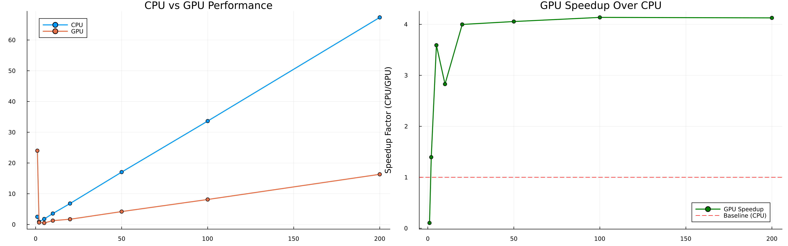

# ArushaRecharge 2.0

[](https://github.com/vcantarella/ArushaRecharge.jl/actions/workflows/CI.yml?query=branch%3Amain)
[](https://github.com/JuliaTesting/Aqua.jl)

---


## What is this?

**ArushaRecharge 2.0** is a proof of concept for a modern, cross-platform soil water balance model written in Julia. The core idea is to demonstrate that you can write a single, maintainable codebase that runs efficiently on both CPUs and vendor-neutral GPUs (using [KernelAbstractions.jl](https://github.com/JuliaGPU/KernelAbstractions.jl)), and test it interactively on a laptop—no supercomputer required.

This project is not a full-featured hydrological model, but a minimal, reproducible example of how to:

- Implement a conceptual soil water balance model in Julia
- Target both CPU and GPU backends with the same code
- Benchmark and test the model on consumer hardware (e.g., Macbook Air M2)
- Provide robust, open, and testable scientific code

---

## Conceptual Model: Soil Water Balance

The model simulates the daily water balance for each cell in a spatial grid, using the following conceptual steps:

1. **Precipitation** is partitioned into effective infiltration and surface runoff, based on a land-use-dependent threshold.
2. **Soil storage** is updated by adding effective precipitation and subtracting actual evapotranspiration (ET) and groundwater recharge.
3. **Actual ET** is computed as a function of potential ET, crop coefficient, and soil moisture availability, according to the FAO model.
4. **Recharge** occurs when soil storage exceeds capacity, with excess draining to groundwater.
5. **Outputs** (runoff, ET, recharge) and change in storage are tracked for each timestep and aggregated by month/year.

This is a classic "bucket" model, widely used in hydrology for its transparency and extensibility. All parameters (thresholds, crop coefficients, soil capacities) are set via lookup tables based on land use and soil type.

---

## GPU Acceleration: Why it matters

Traditional hydrological models are limited by CPU speed. ArushaRecharge uses GPU parallelism to scale up, making previously impossible analyses routine. This is especially valuable for high-resolution, multi-year, or regional studies.

**Benchmark Example:**

<p align="center">
  
</p>

_Left: Execution time for CPU and GPU backends. Right: Speedup factor (CPU/GPU)._

---

## How to run this model:

```julia
using ArushaRecharge, CSV, DataFrames, Dates

# Load climate data
prec_df = CSV.read("arusha_recharge/Climate data/Precipitation_2020.csv", DataFrame)
pet_df = CSV.read("arusha_recharge/Climate data/ET_2020.csv", DataFrame)
prec = prec_df[!, "Precipitation (mm/day)"]
pet = pet_df[!, "ET (mm/day)"]
timestamps = Date.(prec_df[!, "Date"], dateformat"dd/mm/yyyy")

# Run the model (CPU or GPU)
results = ArushaRecharge.run_water_balance(prec, pet, timestamps, :GPU)
```

---

## How it works

1. **Load spatial and climate data**
2. **Set up lookup tables for land use and soil**
3. **Run the water balance kernel (CPU or GPU)**
4. **Aggregate and analyze results**

This is a very particular model. It will be useful to you if you develop a conceptual model, code the kernels yourself, and then adapt this framework to your needs.

---

## License

MIT License. See [LICENSE](LICENSE).
